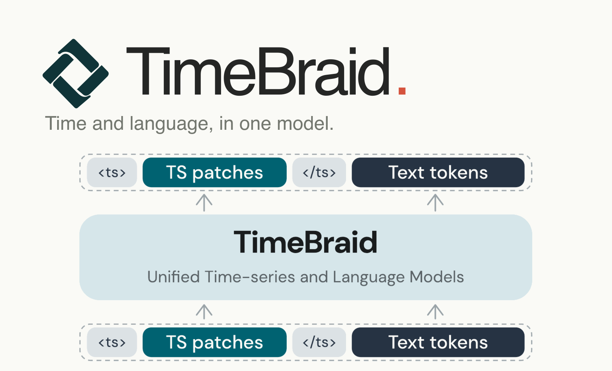
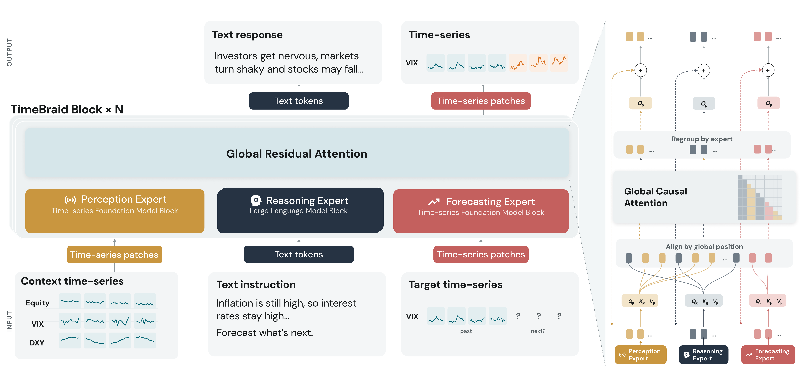

# TimeBraid: Unifying Time Series and Language for Understanding and Forecasting

<p align="center">
  <a href="assets/timebraid-cover.png">
    
  </a>
</p>

[Paper](https://arxiv.org/abs/2609.29792) · [Project page](https://xinyuewangg.com/projects/timebraid/) · [Model weights](https://huggingface.co/XinyueWangg/TimeBraid-2.5B) · [Examples](examples/inference_tasks.ipynb)

TimeBraid brings continuous time series and natural language into one model. A
Qwen3 language backbone and a TimesFM 2.5 time-series expert exchange information
through interleaved Mixture-of-Transformers (MoT) layers. This repository provides its
PyTorch and Hugging Face **inference implementation**.

## What TimeBraid does

| Task | Provide | Receive |
| --- | --- | --- |
| Time-series understanding | A question and one or more numeric series | A natural-language answer |
| Forecasting with context | Observed values, optional text context, and a forecast horizon | Future numeric values for one selected series |
| Text generation | A text prompt | A natural-language response |

Pass raw numeric arrays to `TimeBraidProcessor`; it handles normalization and
time-series formatting. Forecasts are returned on the target series' original
scale. The full numeric history is not serialized as text.

## Architecture

<a href="assets/timebraid-architecture.png">
  
</a>

The architecture diagram is from the paper; its VIX input and outputs illustrate
the model's data flow. Open the image for a full-size view.

## Released model

| Model | Language backbone | Time-series expert | Weight dtype |
| --- | --- | --- | --- |
| [TimeBraid-2.5B](https://huggingface.co/XinyueWangg/TimeBraid-2.5B) | Qwen3-1.7B | TimesFM 2.5 200M | BF16 |

The checkpoint contains both backbones, fusion layers, tokenizer, and processor;
no separate TimesFM download is needed. The 2.5B name rounds **2,497,200,576**
unique parameters, counting frozen parameters and shared embedding/output weights
once. Other model sizes discussed in the paper are not included in this release.

## Try a forecast

After [installation](#installation), run the included example on an NVIDIA GPU:

```bash
python examples/generate.py --model XinyueWangg/TimeBraid-2.5B
```

It supplies six observed values, asks for eight future values, and prints the
structured response. The checkpoint downloads from Hugging Face on first use;
pass a complete local checkpoint directory to `--model` to load it locally.

## Installation

The setup below uses Linux, Python 3.11, the CUDA 12.8 toolkit (including `nvcc`),
and a FlashAttention-2-compatible NVIDIA GPU such as an A100 or H100. Install
Torch and the build prerequisites before FlashAttention:

```bash
git clone https://github.com/CharonWangg/TimeBraid.git
cd TimeBraid
python3.11 -m venv .venv
source .venv/bin/activate
python -m pip install --upgrade pip setuptools wheel packaging psutil ninja
python -m pip install numpy==2.1.3
python -m pip install torch==2.10.0 --index-url https://download.pytorch.org/whl/cu128
MAX_JOBS=4 python -m pip install flash-attn==2.8.3 --no-build-isolation
python -m pip install .
```

FlashAttention is installed separately because its build must match the selected
Torch and CUDA ABI. If no matching wheel is available, the first installation
compiles it from source and can take tens of minutes. For another CUDA installation,
select a compatible Torch 2.10.0 build from the [PyTorch installation table](https://pytorch.org/get-started/previous-versions/#v2100)
and follow the [FlashAttention requirements](https://github.com/Dao-AILab/flash-attention/tree/v2.8.3#installation-and-features).
For an H100-only installation, add `FLASH_ATTN_CUDA_ARCHS=90` before `MAX_JOBS=4`
in the FlashAttention command to compile only that GPU architecture.

## Python API

Import `TimeBraidProcessor` from the installed package to register the TimeBraid
configuration, processor, and model with the Hugging Face AutoClasses. The
example uses the installed code with `trust_remote_code=False`.

```python
import torch

from timebraid import TimeBraidProcessor  # registers the TimeBraid AutoClasses
from transformers import AutoModelForCausalLM, AutoProcessor

model_path = "XinyueWangg/TimeBraid-2.5B"
processor = AutoProcessor.from_pretrained(
    model_path,
    fix_mistral_regex=False,
    trust_remote_code=False,
)
model = AutoModelForCausalLM.from_pretrained(
    model_path,
    dtype=torch.bfloat16,
    attn_implementation="flash_attention_2",
    device_map={"": "cuda:0"},
    trust_remote_code=False,
    use_safetensors=True,
).eval()

inputs = processor.apply_chat_template(
    [{"role": "user", "content": "Forecast the next 8 values."}],
    timeseries=[[101.2, 101.8, 102.1, 102.5, 103.0, 103.4]],
    horizon=8,
    add_generation_prompt=True,
    tokenize=True,
    return_dict=True,
    return_tensors="pt",
).to(model.device)

outputs = model.generate(
    **inputs,
    max_new_tokens=128,
    do_sample=False,
    num_beams=1,
    num_return_sequences=1,
)
result = processor.post_process_generation(outputs, model_inputs=inputs)
print(result)
```

The Python example also downloads the checkpoint on first use. Replace the Hub
ID with a complete local checkpoint path to load it locally.

For text generation, time-series understanding, multi-series comparison, and
forecasting examples, see [`examples/inference_tasks.ipynb`](examples/inference_tasks.ipynb).
Its input/output cards and plots use the optional notebook extra:

```bash
python -m pip install '.[notebook]'
```

## Inference notes

- Mixed text and time-series inference requires one CUDA device and
  FlashAttention 2.
- Generation currently supports one request at a time, greedy decoding, one
  returned sequence, and a fresh prompt.
- Forecasting accepts one or more input series and returns one target series.
  With multiple inputs, pass `target_series_index` explicitly to select the
  zero-based target index; a single input defaults to index `0`.
- Providing `horizon` starts numerical forecasting for the selected target.
  Omit `horizon` for text generation or time-series understanding.
- Complete checkpoints already contain the TimesFM weights; inference does not
  download a second expert checkpoint.
- Import `TimeBraidProcessor` from the installed package before using the Hugging
  Face AutoClasses, and keep `trust_remote_code=False`. The model artifact also
  supports `trust_remote_code=True` without installing this package; that path
  loads the runtime bundled with the model repository.

## Repository guide

| Path | Contents |
| --- | --- |
| [`src/timebraid/`](src/timebraid/) | Processor, model, and Hugging Face integration |
| [`examples/`](examples/) | Runnable command-line example and task notebook |
| [`tests/`](tests/) | Runtime and public API checks |
| [`scripts/`](scripts/) | Checkpoint packaging and validation utilities |

This release focuses on inference. Training and benchmark pipelines are not
included. The companion [Alignment](https://huggingface.co/datasets/XinyueWangg/TimeBraid-Alignment)
and [SFT](https://huggingface.co/datasets/XinyueWangg/TimeBraid-SFT) dataset
repositories currently provide descriptions only; redistribution is pending
permission.

## Development

```bash
python -m pip install -e '.[test]'
python -m pytest -q
python -m ruff check .
python -m ruff format --check .
```

## Citation

If you use TimeBraid in your work, please cite the [arXiv preprint](https://arxiv.org/abs/2609.29792):

```bibtex
@misc{wang2026timebraidunifyingtimeseries,
      title={TimeBraid: Unifying Time Series and Language for Understanding and Forecasting},
      author={Xinyue Wang and Jiacheng Pang and Kun Zhou and Kexin Zhang and Defu Cao and Fan Feng and Faisal and Songyao Jin and Yan Liu and Biwei Huang},
      year={2026},
      eprint={2609.29792},
      archivePrefix={arXiv},
      primaryClass={cs.CL},
      url={https://arxiv.org/abs/2609.29792},
}
```

## Acknowledgements

TimeBraid builds on the following open-source projects:

- [Qwen3](https://github.com/QwenLM/Qwen3) and
  [Transformers](https://github.com/huggingface/transformers) provide the
  language-model backbone and Hugging Face integration.
- [TimesFM](https://github.com/google-research/timesfm) provides the
  time-series expert. This repository includes a modified, PyTorch-only subset
  of TimesFM 2.5 under `src/timebraid/_vendor/timesfm/`.
- [LlamaFactory](https://github.com/hiyouga/LLaMA-Factory) informed the project's
  early training and experimentation workflow.

We thank the authors and contributors of these projects for making their work
available to the community.

## License

TimeBraid source code and TimeBraid model weights are released under the Apache
License 2.0. See `LICENSE`.
